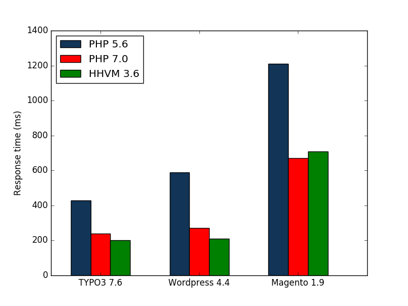
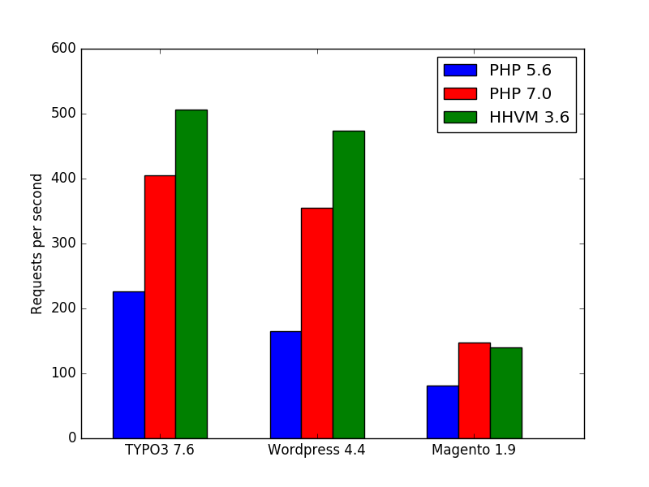

# PHP 7 benchmark

## What is this?

This repository contains a benchmark of the latest PHP 7 release that I've created while authoring an article for the [T3N magazine](http://t3n.de) (issue 43).

I found several benchmarks on the web ([one](http://www.zend.com/en/resources/php7_infographic), [two](https://kinsta.com/blog/hhvm-vs-php-7/), [three](http://www.lornajane.net/posts/2015/php-7-benchmarks) and many more) and was eager to see if I could reproduce the results. Also, I didn't find any benchmarks that included [TYPO3 CMS](http://typo3.org) in the benchmarked applications.

## The results

The results of my benchmark correspond to the results of similar benchmarks found on the web. However, when comparing my results to [Zend's benchmark](http://www.zend.com/en/resources/php7_infographic) I was surpised to find that in my benchmark, HHVM still fared (mostly, but in some cases significantly) better than a recent PHP 7 (except when running Magento. Who known what's happening there).

## This repository

This repository contains:

- The benchmark environments (all Dockerized, with Dockerfiles for the respective containers and `docker-compose.yml` files for setting up the benchmark infrastructure) for TYPO3 (`typo3/`), Wordpress (`wordpress/`) and Magento (`magento/`).
- The result data (`/data`)
- Some Python scripts for interpreting and rendering the result data (`/plot`)
